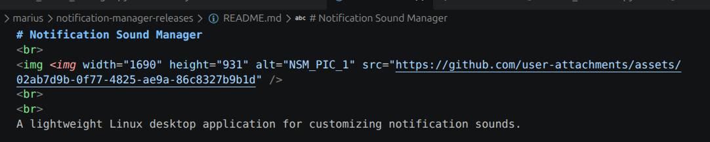

# Notification Sound Manager
<br>

<br>
<br>
A lightweight Linux desktop application for customizing notification sounds.

Notification Sound Manager lets you configure separate sounds and volume levels for:
- General notifications
- Email notifications
- Discord notifications
- Individual Discord servers
- Login/startup

For General, Email, and Discord notifications, Notification Sound Manager listens for desktop notification events and plays the sound you have configured. It does not replace or disable the notification itself.

If the application already plays its own notification sound, you may want to disable that application's built-in sound to avoid hearing both sounds at the same time.

**Important:** Do not disable the desktop notifications themselves. Notification Sound Manager relies on those notification events to detect when a sound should be played.

The Login sound works separately and is played when your desktop session starts.

### What's new in 1.4.0
- Redesigned interface with sidebar navigation and dedicated pages
- Added Discord server-specific sound overrides
- Individual sound, volume, and enable/disable controls for Discord server overrides
- Discord server detection supports styled Unicode server names
- Improved Email and System settings layout
- Improved dark mode styling and visual consistency
- General UI polish and refinements

### Supported Email Clients
Email notifications are currently recognized from:
- Thunderbird
- Evolution
- KMail
- Geary
- Mailspring
- Claws Mail

## Installation
Download the latest `.deb` package from the **Releases** section.
Then install it with:
```bash
sudo apt install ./notification-sound-manager_1.4.0_all.deb
``` 
Replace the 1.4.0 section of the command with whatever version you downloaded. Newest is always better unless specified otherwise.
